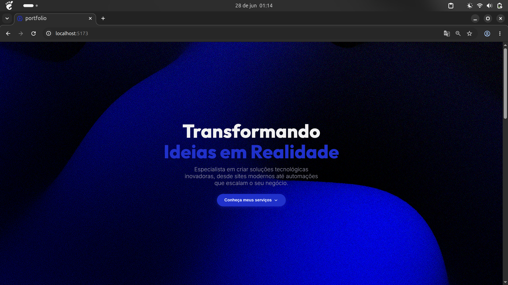
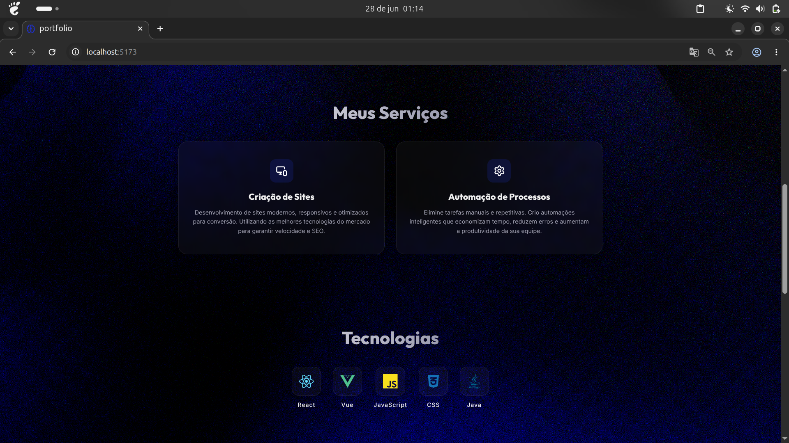

<div align="center">

# 🚀 Landing Page - Portfólio

### Desenvolvido com React + Vite

Uma landing page moderna, responsiva e otimizada para apresentar meus serviços como desenvolvedor Front-end e especialista em automação de processos.

<p align="center">
  
  
  
  
  
</p>

</div>

---

# 📸 Preview

<p align="center">
  
</p>

<p align="center">
  
</p>

---

# 📖 Sobre o Projeto

Esta Landing Page foi desenvolvida utilizando **React + Vite**, com foco em desempenho, design moderno e responsividade.

O projeto foi criado para servir como meu portfólio profissional, apresentando meus serviços, tecnologias e competências de forma clara, elegante e objetiva.

Toda a interface foi construída visando oferecer uma excelente experiência ao usuário em qualquer dispositivo.

---

# ✨ Funcionalidades

- ✅ Interface moderna e intuitiva
- ✅ Layout totalmente responsivo
- ✅ Alta performance utilizando Vite
- ✅ Scroll suave entre seções
- ✅ Cards de serviços
- ✅ Seção de tecnologias
- ✅ Design minimalista
- ✅ Componentização com React
- ✅ Código organizado e escalável

---

# 🛠️ Tecnologias Utilizadas

| Tecnologia | Utilização |
|------------|------------|
| ⚛️ React | Construção da interface |
| ⚡ Vite | Ambiente de desenvolvimento |
| 🟨 JavaScript | Lógica da aplicação |
| 🎨 CSS3 | Estilização |
| 🌐 HTML5 | Estrutura da aplicação |

---

# 📂 Estrutura do Projeto

```text
pagina-pessoal/
│
├── docs/
│   ├── image1.png
│   └── image2.png
│
├── public/
│   ├── favicon.svg
│   ├── icons.svg
│   └── profile-person.png
│
├── src/
│   ├── assets/
│   │   ├── hero.png
│   │   ├── react.svg
│   │   └── vite.svg
│   │
│   ├── App.jsx
│   ├── App.css
│   ├── index.css
│   └── main.jsx
│
├── index.html
├── package.json
├── package-lock.json
├── vite.config.js
└── README.md
```

---

# 🚀 Como executar o projeto

### Clone o repositório

```bash
git clone https://github.com/CaioFerreira-j/pagina-pessoal.git
```

### Entre na pasta

```bash
cd pagina-pessoal
```

### Instale as dependências

```bash
npm install
```

### Execute o projeto

```bash
npm run dev
```

A aplicação estará disponível em:

```text
http://localhost:5173
```

---

# 💻 Serviços Apresentados

- 🌐 Desenvolvimento de Sites
- ⚙️ Automação de Processos
- 📱 Interfaces Responsivas
- 🚀 Soluções Web Modernas

---

# 📚 Tecnologias em Destaque

- React
- JavaScript
- Vue.js
- CSS3
- Java
- HTML5

---

# 🎯 Objetivos do Projeto

Este projeto foi desenvolvido para:

- Apresentar meu portfólio profissional
- Demonstrar minhas habilidades em desenvolvimento Front-end
- Divulgar meus serviços
- Praticar boas práticas de desenvolvimento utilizando React
- Criar uma interface moderna e agradável

---

# 🚀 Melhorias Futuras

- [ ] Seção de Projetos
- [ ] Formulário de contato funcional
- [ ] Integração com EmailJS
- [ ] Modo claro/escuro
- [ ] Internacionalização (PT/EN)
- [ ] Mais animações com Framer Motion
- [ ] Deploy automático via GitHub Actions

---

# 📄 Licença

Este projeto está licenciado sob a licença **MIT**.

Sinta-se à vontade para estudar o código, utilizá-lo como referência e contribuir com melhorias.

---

# 👨‍💻 Autor

## Caio Juan dos Santos Ferreira

Desenvolvedor Front-end focado em criar interfaces modernas, aplicações performáticas e soluções inteligentes através da automação de processos e Inteligência Artificial.

### Tecnologias

- ⚛️ React
- 🟨 JavaScript
- ☕ Java
- 🌐 HTML & CSS
- 🤖 Inteligência Artificial
- 🔄 n8n
- ⚙️ Automação de Processos

---

<div align="center">

### ⭐ Se este projeto foi útil para você, deixe uma estrela no repositório!

---

Desenvolvido com ❤️ por **Caio Juan dos Santos Ferreira**

</div>
